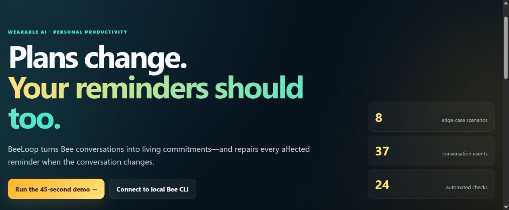
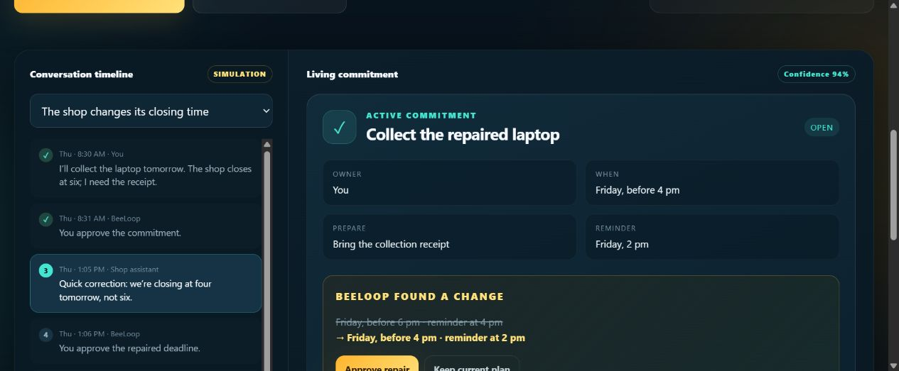

# BeeLoop

> Plans change. Your reminders should too.

BeeLoop is a correction-aware commitment layer for Amazon Bee. It turns processed conversation events into reviewable commitments and repairs the same commitment when a later conversation changes the owner, time, place, dependency, completion state or cancellation.



## Why this matters

Existing assistants are good at extracting a reminder from one sentence. They are far less reliable when reality changes across conversations. A stale reminder can cause a missed appointment, wasted trip or broken promise. BeeLoop treats corrections as first-class events and keeps one source-linked, versioned plan.

## Signature demo

1. Bee captures: “I’ll collect the laptop tomorrow. The shop closes at six.”
2. BeeLoop proposes one commitment and waits for approval.
3. A later Bee conversation says: “We’re closing at four tomorrow, not six.”
4. BeeLoop links the correction to the existing commitment, shows a before/after repair and moves the reminder from 4 pm to 2 pm after approval.
5. No duplicate reminder survives.



The prototype also handles speaker correction, tentative handoff and cancellation. It currently includes **4 scenarios, 21 conversation events and 13 passing behavioral checks**.

## Real Bee runtime hook

`server.mjs` imports the official CLI wrapper:

```js
const { createBeeClient } = await import('@beeai/cli/lib');
const bee = createBeeClient();
const profile = await bee.api.me();
const stream = bee.sse.streamJson({
  types: ['new-utterance', 'todo-created', 'todo-updated', 'todo-deleted']
});
```

The app never bundles credentials. Authentication remains in the local Bee CLI. Without an authenticated Bee account, the UI clearly identifies its hand-authored fixture as **synthetic**.

## Run

Requirements: Node.js 20+, the Bee mobile app, and (for live mode) an authenticated Bee CLI.

```bash
npm install
npm start
```

Open `http://127.0.0.1:4173`.

For live data:

```bash
npm install -g @beeai/cli
bee login
npm start
```

Then select **Connect to local Bee CLI**. Developer Mode must be enabled in the Bee app. According to the Bee documentation, this requires tapping the app version five times in Settings; the hackathon FAQ notes that Android Developer Mode requires a paired Bee device.

## Test

```bash
npm test
```

The deterministic tests cover approval gating, correction propagation, idempotency, speaker repair, ambiguous handoffs, cancellations and completion.

## Privacy and safety

- No real conversation data is committed to this repository.
- The synthetic fixture is explicitly labelled.
- Consequential or low-confidence changes require review.
- State changes preserve source lineage and remain reversible.
- Local Bee authentication tokens never pass through the browser UI.

## Repository map

- `server.mjs` — local web server and real Bee CLI adapter
- `core.mjs` — deterministic commitment state machine
- `scenarios.mjs` — synthetic demo scenarios
- `app.js` — interactive product experience
- `sample-data/bee-events.json` — privacy-safe documented-envelope fixture
- `tests/` — automated behavior checks
- `docs/ARCHITECTURE.md` — integration details
- `docs/FRICTION_LOG.md` — actionable Bee developer feedback
- `docs/DEMO_SCRIPT.md` — sub-three-minute demo plan

## Submission status

The code path for the official Bee CLI is implemented. A compliant Bee-track submission still requires a final recorded demo using data captured and processed by an actual Bee device or an Apple Watch running Bee software. The synthetic fixture must not be represented as satisfying that requirement.

## License

MIT
